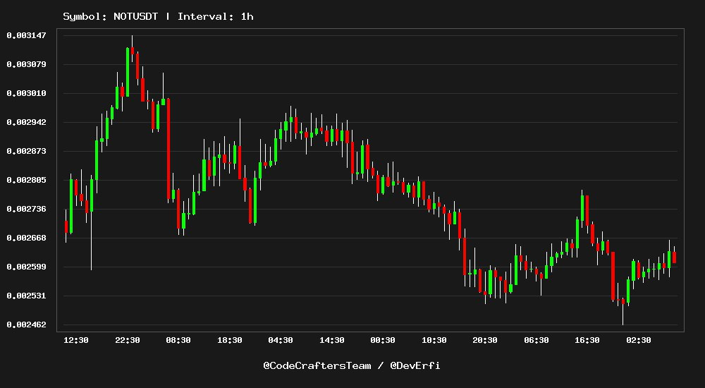

🚀 Crypto Chart Generator - CreateChart-In-Binance 🚀

Crypto Chart Generator is a simple PHP-based tool that allows you to fetch real-time candlestick data from the Binance API and visualize it through a generated chart. This project helps users monitor cryptocurrency price fluctuations in a visually appealing way. 📉📊

Here is an example of the chart generated from the Binance API:

✨ Features:
Fetches candlestick data from the Binance API for a given cryptocurrency symbol (e.g., BTC/USDT) 📈
Generates and displays live candlestick charts 🖼️

Supports different time intervals (e.g., 1 hour, 1 day) ⏱️
Simple and easy-to-use code for developers to integrate into their applications 🔧
Stunning visual experience with cryptocurrency data 💻

🔧 Technologies Used:
PHP: The main backend language for fetching data and generating charts 🖥️
Binance API: For retrieving real-time candlestick data 🔗
GD Library: For generating candlestick chart images 📊
JSON: For data handling between the Binance API and the PHP script 📂

📚 How It Works:
The user defines the cryptocurrency symbol (e.g., BTCUSDT) 💡
The script fetches candlestick data from the Binance API for the specified symbol and interval 📡
The data is parsed and processed to create a visual candlestick chart 🔍
The generated chart is saved as a PNG image 📸

⚙️ Requirements:
To run this project, ensure you have the following:

PHP 7.4 or higher 🔧
GD Library enabled in PHP (required for image generation) 🖼️
An internet connection to fetch data from the Binance API 🌐
🚀 Setup Instructions:
Clone the repository:

git clone https://github.com/DevMrErfan/CreateChart-In-Binance.git
cd CreateChart-In-Binance
Set up the files: Ensure the src/ folder contains the following PHP files:

Candeldata.php: Fetches the candlestick data from Binance.
createChart.php: Generates the chart image based on the data.

View the chart: The generated chart image will be saved as chart.png in the project folder. You can open this file to view the generated candlestick chart. 📂

✨ Customization:
You can customize the following settings:

Symbol: Change the symbol in index.php to track different cryptocurrencies (e.g., ETHUSDT for Ethereum).
Timeframe: Adjust the timeframe in index.php to get different time intervals (e.g., 5m for 5-minute intervals or 1d for daily candlesticks). ⏳
📜 License:
This project is licensed under the MIT License.

💡 Contributing:
Feel free to fork the repository and contribute by submitting pull requests. Any improvements, bug fixes, or feature suggestions are welcome!

🔧 Additional Notes:
Make sure to configure your PHP environment to enable the GD library, which is necessary for image generation.
The Binance API provides a wealth of other data that can be used in conjunction with this project for more advanced charting features.
